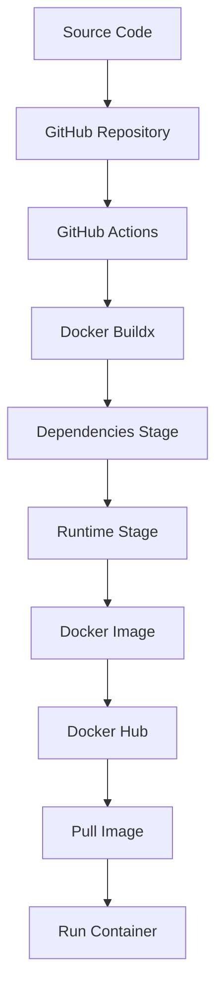
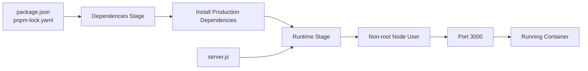

<h1 align="center">🐳 Docker CI Pipeline</h1>

<p align="center">
  A beginner-friendly Node.js project that demonstrates how to build, containerize, and automatically publish an application using Docker and GitHub Actions.
</p>

<p align="center">
  <a href="https://github.com/Sasivarnasarma/docker-ci-pipeline/actions/workflows/docker-publish.yml">
    
  </a>
  
  
  
  
  
</p>

---

## 📖 About This Project

This is a small Node.js and Express application created to learn the complete process of containerizing an application and publishing it automatically.

The project starts as a simple Express server and gradually becomes a Docker image that can be built and published automatically through GitHub Actions.

The complete flow is:

```text
Write Code
    ↓
Build Docker Image
    ↓
Test Locally
    ↓
Push Code to GitHub
    ↓
GitHub Actions
    ↓
Docker Buildx
    ↓
Docker Hub
    ↓
Pull and Run the Published Image
```

This project is mainly focused on learning how these tools work together.

---

## ✨ What This Project Covers

- Node.js 24 with Express 5
- pnpm package management
- Docker multi-stage builds
- Smaller production images
- Running containers as a non-root user
- Docker health checks
- BuildKit cache for faster builds
- Docker Hub image publishing
- GitHub Actions CI/CD
- Unique Docker image tags
- Docker image metadata
- SBOM and provenance generation
- Pulling and running the published image

---

## 🏗️ Project Architecture

The Docker image uses two stages.



### Docker stages



The first stage installs the dependencies.

The second stage contains only what is needed to run the application.

This keeps the final image cleaner and avoids putting unnecessary build files into the runtime image.

---

# 🚀 Complete Walkthrough

> This section explains the project from the beginning.
>
> If you are new to Docker or GitHub Actions, follow the sections in order.

## 1️⃣ Create the Node.js Project

### Step 1.1: Create a project folder

Choose a location on your computer and create the project:

```bash
mkdir docker-ci-pipeline
cd docker-ci-pipeline
```

Initialize a Git repository:

```bash
git init
```

### Step 1.2: Initialize the Node.js project

This project uses **pnpm**.

If you already have pnpm installed, initialize the project:

```bash
pnpm init
```

If you do not have pnpm installed, enable it through Corepack:

```bash
corepack enable
```

Then run:

```bash
pnpm init
```

### Step 1.3: Install Express

Install Express 5:

```bash
pnpm add express@5
```

### Step 1.4: Add the start script

Run:

```bash
pnpm pkg set scripts.start="node server.js"
```

Your `package.json` should now contain a start script similar to:

```json
{
  "scripts": {
    "start": "node server.js"
  }
}
```

---

## 2️⃣ Create the Express Application

Create a file named:

```text
server.js
```

Add:

```js
const express = require("express");

const app = express();
const PORT = process.env.PORT || 3000;

app.get("/", (req, res) => {
  res.json({
    message: "Hello from Docker!",
    runtime: process.version,
    dev: "Your Name",
  });
});

app.get("/health", (req, res) => {
  res.send("ok");
});

app.listen(PORT, "0.0.0.0", () => {
  console.log(`Server running on port ${PORT}`);
});
```

### Why `0.0.0.0`?

Inside a Docker container, the application needs to listen on all network interfaces so that Docker can forward traffic to it.

That is why we use:

```js
app.listen(PORT, "0.0.0.0");
```

### Test the application locally

Install the dependencies:

```bash
pnpm install
```

Start the server:

```bash
pnpm start
```

You should see something similar to:

```text
Server running on port 3000
```

Open:

```text
http://localhost:3000
```

You can also test the health endpoint:

```text
http://localhost:3000/health
```

It should return:

```text
ok
```

Stop the server with:

```text
Ctrl + C
```

---

## 3️⃣ Create the Dockerfile

Create a file named:

```text
Dockerfile
```

Add:

```dockerfile
# syntax=docker/dockerfile:1

FROM node:24-bookworm-slim AS dependencies

WORKDIR /app

RUN corepack enable

COPY package.json pnpm-lock.yaml ./

RUN --mount=type=cache,target=/root/.local/share/pnpm/store \\
    pnpm install --frozen-lockfile --prod


FROM node:24-bookworm-slim AS runtime

ENV NODE_ENV=production

WORKDIR /app

RUN corepack enable

COPY --from=dependencies --chown=node:node /app/node_modules ./node_modules
COPY --chown=node:node package.json server.js ./

USER node

EXPOSE 3000

HEALTHCHECK --interval=30s --timeout=3s --start-period=5s --retries=3 \\
    CMD node -e "fetch('http://127.0.0.1:3000/health').then(r=>process.exit(r.ok?0:1)).catch(()=>process.exit(1))"

CMD ["node", "server.js"]
```

### What is happening here?

The Dockerfile has two stages.

#### Dependencies stage

```dockerfile
FROM node:24-bookworm-slim AS dependencies
```

This stage installs the production dependencies.

We copy the package files first:

```dockerfile
COPY package.json pnpm-lock.yaml ./
```

Then install:

```dockerfile
pnpm install --frozen-lockfile --prod
```

Using `--frozen-lockfile` makes sure the installation follows the lockfile exactly.

#### Runtime stage

The runtime stage starts from a clean Node.js image:

```dockerfile
FROM node:24-bookworm-slim AS runtime
```

Only the required files are copied into this stage.

The application runs as the built-in `node` user:

```dockerfile
USER node
```

This is safer than running the application as root.

#### Health check

Docker checks:

```text
http://127.0.0.1:3000/health
```

If the endpoint responds successfully, Docker considers the container healthy.

---

## 4️⃣ Add .dockerignore

Create:

```text
.dockerignore
```

Add:

```text
node_modules
pnpm-debug.log*
.git
.github
.env
.env.*
coverage
README.md
Dockerfile*
.dockerignore
```

### Why do we need this?

Docker sends the project directory to the Docker build process.

There is no reason to send files such as:

- `node_modules`
- `.git`
- `.env`
- logs
- coverage files

Ignoring them makes the build context smaller and helps prevent unnecessary files from entering the build process.

---

## 5️⃣ Add .gitignore

Create:

```text
.gitignore
```

Add:

```text
# Dependencies
node_modules/

# Environment variables / secrets
.env
.env.*
!.env.example

# Logs
npm-debug.log*
pnpm-debug.log*
yarn-debug.log*
*.log

# Test / coverage
coverage/

# OS files
.DS_Store
Thumbs.db

# IDE / editors
.vscode/
.idea/

# Docker
*.dockerfile
```

The `.gitignore` prevents unnecessary files and local secrets from being committed to Git.

---

## 6️⃣ Build the Docker Image Locally

Before using GitHub Actions, test the Docker image on your own computer.

Build the image:

```bash
docker build --pull --tag YOUR_DOCKERHUB_USERNAME/docker-ci-pipeline:local .
```

Replace:

```text
YOUR_DOCKERHUB_USERNAME
```

with your Docker Hub username.

For example:

```bash
docker build --pull --tag yourname/docker-ci-pipeline:local .
```

Check that the image exists:

```bash
docker images
```

You should see:

```text
yourname/docker-ci-pipeline
```

### Run the container

```bash
docker run -d \\
  --name docker-ci-local \\
  -p 3000:3000 \\
  yourname/docker-ci-pipeline:local
```

Check the container:

```bash
docker ps
```

### Test the application

Open:

```text
http://localhost:3000
```

Or use:

```bash
curl http://localhost:3000
```

Test the health endpoint:

```bash
curl http://localhost:3000/health
```

Expected result:

```text
ok
```

### Check the container health

Run:

```bash
docker ps
```

After a few seconds, the status should show:

```text
healthy
```

### Check that the container does not run as root

Run:

```bash
docker inspect docker-ci-local --format='{{.Config.User}}'
```

Expected result:

```text
node
```

This confirms that the application runs using the non-root `node` user.

### View the image history

```bash
docker history yourname/docker-ci-pipeline:local
```

### View container logs

```bash
docker logs docker-ci-local
```

### Stop the container

```bash
docker stop docker-ci-local
```

Remove it:

```bash
docker rm docker-ci-local
```

---

## 7️⃣ Create a Docker Hub Repository

You need a Docker Hub repository where GitHub Actions can publish the image.

Go to Docker Hub and create a new repository.

Use:

```text
Repository name: docker-ci-pipeline
```

The image will eventually look like:

```text
YOUR_DOCKERHUB_USERNAME/docker-ci-pipeline
```

For this learning project, the repository can be public so that others can pull and run the image.

### Important

Never put your Docker Hub password or access token inside:

- `Dockerfile`
- GitHub Actions YAML
- source code
- README
- screenshots
- Git history

Keep the token private.

---

## 8️⃣ Create a Docker Hub Access Token

GitHub Actions needs permission to push images to Docker Hub.

Instead of using your Docker Hub password, create an access token.

Create a token with:

```text
Permission: Read & Write
```

Delete permission is not required for this project.

Give the token a clear name, for example:

```text
github-actions-docker-ci
```

Copy the token when Docker Hub shows it.

> ⚠️ Keep this token private.
>
> Do not add the actual token to this README or your Git repository.

---

## 9️⃣ Add GitHub Repository Variables and Secrets

Open your GitHub repository.

Go to:

```text
Settings
    ↓
Secrets and variables
    ↓
Actions
```

### Add repository variable

Create a variable:

```text
Name:
DOCKERHUB_USERNAME
```

Value:

```text
YOUR_DOCKERHUB_USERNAME
```

For example:

```text
yourname
```

### Add repository secret

Create a secret:

```text
Name:
DOCKERHUB_TOKEN
```

Value:

```text
YOUR_DOCKERHUB_ACCESS_TOKEN
```

The token should be stored as a GitHub secret.

GitHub will hide the secret from normal workflow output.

---

## 🔟 Create the GitHub Actions Workflow

Create the following folder:

```text
.github/workflows
```

Then create:

```text
.github/workflows/docker-publish.yml
```

Add:

```yaml
name: Build and push Docker image

on:
  push:
    branches: [main]
  workflow_dispatch:

permissions:
  contents: read

env:
  IMAGE_NAME: ${{ vars.DOCKERHUB_USERNAME }}/docker-ci-pipeline

jobs:
  publish:
    runs-on: ubuntu-latest

    steps:
      - name: Checkout
        uses: actions/checkout@v6

      - name: Set up Docker Buildx
        uses: docker/setup-buildx-action@v4

      - name: Log in to Docker Hub
        uses: docker/login-action@v4
        with:
          username: ${{ vars.DOCKERHUB_USERNAME }}
          password: ${{ secrets.DOCKERHUB_TOKEN }}

      - name: Extract Docker metadata
        id: meta
        uses: docker/metadata-action@v6
        with:
          images: ${{ env.IMAGE_NAME }}
          tags: |
            type=raw,value=run-${{ github.run_id }}-${{ github.run_attempt }}
            type=sha,prefix=sha-
            type=raw,value=latest,enable=${{ github.ref == 'refs/heads/main' }}
          labels: |
            org.opencontainers.image.title=Docker CI Pipeline
            org.opencontainers.image.description=Node.js Docker CI pipeline

      - name: Build and push
        id: push
        uses: docker/build-push-action@v7
        with:
          context: .
          push: true
          pull: true
          tags: ${{ steps.meta.outputs.tags }}
          labels: ${{ steps.meta.outputs.labels }}
          cache-from: type=gha
          cache-to: type=gha,mode=max
          provenance: mode=max
          sbom: true

      - name: Show image reference
        run: |
          echo "Unique tag: ${IMAGE_NAME}:run-${GITHUB_RUN_ID}-${GITHUB_RUN_ATTEMPT}"
          echo "Digest: ${{ steps.push.outputs.digest }}"
```

### What does this workflow do?

Every time code is pushed to the `main` branch:

```text
GitHub
   ↓
GitHub Actions starts
   ↓
Checkout source code
   ↓
Set up Docker Buildx
   ↓
Login to Docker Hub
   ↓
Create image tags
   ↓
Build Docker image
   ↓
Push image to Docker Hub
```

The workflow can also be started manually using:

```text
Actions → Build and push Docker image → Run workflow
```

---

## 1️⃣1️⃣ Understand the Docker Image Tags

The workflow creates multiple tags.

### Unique run tag

```text
run-<run_id>-<run_attempt>
```

For example:

```text
run-123456789-1
```

This identifies a specific GitHub Actions run and attempt.

### Git commit tag

The workflow also creates a tag similar to:

```text
sha-abc1234
```

This connects the Docker image to the Git commit that created it.

### Latest tag

Successful builds on the `main` branch also receive:

```text
latest
```

So Docker Hub may contain:

```text
docker-ci-pipeline
├── latest
├── sha-abc1234
└── run-123456789-1
```

The unique `run-*` tag is useful because it lets you pull the exact image produced by a particular workflow execution.

---

## 1️⃣2️⃣ Commit and Push the Project

Check your Git status:

```bash
git status
```

Add the files:

```bash
git add .
```

Create a commit:

```bash
git commit -m "👷 ci: add Docker image publishing workflow"
```

Make sure your GitHub repository uses `main`:

```bash
git branch -M main
```

Add your GitHub repository as the remote:

```bash
git remote add origin https://github.com/YOUR_GITHUB_USERNAME/docker-ci-pipeline.git
```

Replace:

```text
YOUR_GITHUB_USERNAME
```

with your GitHub username.

Push the project:

```bash
git push -u origin main
```

---

## 1️⃣3️⃣ Check GitHub Actions

Open your GitHub repository and select:

```text
Actions
```

You should see:

```text
Build and push Docker image
```

Open the workflow run.

You should see steps similar to:

```text
✓ Checkout
✓ Set up Docker Buildx
✓ Log in to Docker Hub
✓ Extract Docker metadata
✓ Build and push
✓ Show image reference
```

If every step is green, the image was successfully built and pushed.

At the end of the logs, you should see something similar to:

```text
Unique tag: yourname/docker-ci-pipeline:run-123456789-1
Digest: sha256:...
```

Save the unique image tag if you want to test that exact image.

---

## 1️⃣4️⃣ Check Docker Hub

Open your Docker Hub repository.

You should see tags similar to:

```text
latest
sha-abc1234
run-123456789-1
```

The exact values will be different for every project and workflow run.

Do not copy the example values from this README.

Use the tag shown in your own GitHub Actions workflow.

---

## 1️⃣5️⃣ Pull the Published Image

Now test the image from Docker Hub.

Use your own username and the unique tag from GitHub Actions:

```bash
docker pull YOUR_DOCKERHUB_USERNAME/docker-ci-pipeline:<run-tag>
```

For example:

```bash
docker pull yourname/docker-ci-pipeline:run-123456789-1
```

Run it:

```bash
docker run -d \\
  --name docker-ci-remote \\
  -p 3000:3000 \\
  YOUR_DOCKERHUB_USERNAME/docker-ci-pipeline:<run-tag>
```

Check the container:

```bash
docker ps
```

Test the application:

```bash
curl http://localhost:3000
```

Test the health endpoint:

```bash
curl http://localhost:3000/health
```

Expected result:

```text
ok
```

You have now pulled the image from Docker Hub and successfully run it locally.

---

## 1️⃣6️⃣ Test a Workflow Rerun

GitHub Actions allows you to rerun a workflow.

Go to:

```text
GitHub Repository
    ↓
Actions
    ↓
Build and push Docker image
    ↓
Select a previous run
    ↓
Re-run jobs
```

The `github.run_id` remains the same for a rerun.

The `github.run_attempt` increases.

For example:

```text
First attempt:
run-123456789-1

Rerun:
run-123456789-2
```

This means each execution attempt can have its own unique Docker image tag.

---

## 1️⃣7️⃣ Clean Up Docker Resources

After testing, stop the container:

```bash
docker stop docker-ci-remote
```

Remove it:

```bash
docker rm docker-ci-remote
```

You can check your containers with:

```bash
docker ps -a
```

You can check your local images with:

```bash
docker images
```

---

# 🔐 Security Notes

This project uses a few simple security practices.

### Run as a non-root user

The Dockerfile contains:

```dockerfile
USER node
```

The application therefore does not run as root inside the container.

### Keep secrets outside the repository

The Docker Hub token is stored in:

```text
GitHub Repository Secrets
```

It is accessed through:

```yaml
${{ secrets.DOCKERHUB_TOKEN }}
```

Never replace this with the actual token.

### Use a limited Docker Hub token

The token only needs the permissions required for this project.

Read and Write access is enough.

Delete permission is not required.

---

# 📁 Project Structure

After completing the project, the structure should look similar to:

```text
docker-ci-pipeline/
│
├── .github/
│   └── workflows/
│       └── docker-publish.yml
│
├── node_modules/
│
├── .dockerignore
├── .gitignore
├── Dockerfile
├── package.json
├── pnpm-lock.yaml
├── server.js
└── README.md
```

`node_modules` is generated locally and should not be committed to Git.

---

# 🌐 API Endpoints

| Method | Endpoint  | Description                         |
| ------ | --------- | ----------------------------------- |
| GET    | `/`       | Returns application information     |
| GET    | `/health` | Returns the container health status |

### Root endpoint

```text
GET /
```

Example response:

```json
{
  "message": "Hello from Docker!",
  "runtime": "v24.x.x",
  "dev": "Your Name"
}
```

### Health endpoint

```text
GET /health
```

Response:

```text
ok
```

---

# ⚙️ Configuration

The application uses the following environment variable:

```text
PORT
```

If `PORT` is not provided, the application uses:

```text
3000
```

For example:

```bash
docker run -d \\
  -p 8080:8080 \\
  -e PORT=8080 \\
  yourname/docker-ci-pipeline:latest
```

The application will then listen on port `8080` inside the container.

---

# 🧠 What I Learned

This is a **learning project built to understand the complete process from application code to a published Docker image**.

While building it, I learned how the different tools connect together instead of learning them separately.

### Node.js and Express

I learned how to:

- Create a simple Express application
- Create API endpoints
- Add a health endpoint
- Configure the application to run inside Docker

### pnpm

I learned how to:

- Initialize a Node.js project with pnpm
- Install dependencies
- Use `pnpm-lock.yaml`
- Install production dependencies
- Use Corepack inside Docker

### Docker

I learned how to:

- Write a Dockerfile
- Build Docker images
- Run containers
- Expose ports
- Add health checks
- Use multi-stage builds
- Use BuildKit cache
- Run containers as a non-root user
- Inspect images and containers
- Pull images from Docker Hub

### Docker Hub

I learned how to:

- Create a Docker Hub repository
- Create an access token
- Push Docker images
- Pull published images
- Use different image tags

### GitHub Actions

I learned how to:

- Create a CI/CD workflow
- Trigger workflows when code is pushed
- Build Docker images automatically
- Authenticate with Docker Hub
- Publish images automatically
- Generate unique image tags
- Use GitHub Actions cache
- Add image provenance and SBOM information

### End-to-End Workflow

Most importantly, I learned how all of these pieces work together:

```text
Local Code
    ↓
Git
    ↓
GitHub
    ↓
GitHub Actions
    ↓
Docker Buildx
    ↓
Docker Image
    ↓
Docker Hub
    ↓
Pull Image
    ↓
Run Application
```

This project helped me understand an **end-to-end containerization and CI/CD workflow**, starting from a simple Node.js application and ending with a Docker image that can be automatically published and pulled from Docker Hub.

---

# 🔄 Final Workflow

Once everything is configured, the normal workflow becomes very simple:

```bash
# Make changes
git add .

# Commit changes
git commit -m "✨ feat: update application"

# Push to GitHub
git push
```

Then GitHub Actions automatically:

```text
Push
 ↓
Build
 ↓
Test/Package
 ↓
Tag
 ↓
Publish
 ↓
Docker Hub
```

You can then pull the latest image:

```bash
docker pull YOUR_DOCKERHUB_USERNAME/docker-ci-pipeline:latest
```

And run it:

```bash
docker run -d \\
  --name docker-ci \\
  -p 3000:3000 \\
  YOUR_DOCKERHUB_USERNAME/docker-ci-pipeline:latest
```

---

# 📚 Useful Links

- [GitHub Repository](https://github.com/Sasivarnasarma/docker-ci-pipeline)
- [GitHub Actions Workflow](https://github.com/Sasivarnasarma/docker-ci-pipeline/actions/workflows/docker-publish.yml)
- [Docker Hub](https://hub.docker.com/)
- [Node.js](https://nodejs.org/)
- [Express](https://expressjs.com/)
- [Docker](https://www.docker.com/)
- [GitHub Actions](https://docs.github.com/en/actions)

---

# 📄 License

This project is licensed under the ISC License.

---

<p align="center">
  Built as a hands-on learning project to understand Docker, Docker Hub, and GitHub Actions from end to end.
</p>
